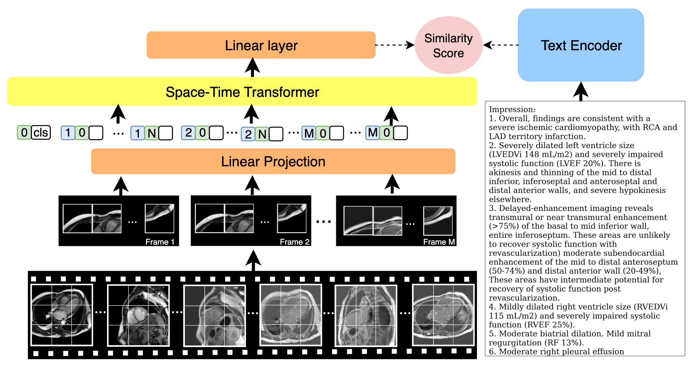

# CMRCLIP

CMRCLIP is a multimodal contrastive learning framework designed for cardiac magnetic resonance (CMR) imaging. It learns joint embeddings between CMR videos and clinical notes (impression section), enabling tasks such as video-text retrieval, zero-shot classification and few-shot learning in the cardiac imaging domain.



## 🌟 Features

- **Multimodal Learning**: Joint video-text representation learning using contrastive learning
- **Medical Domain Focused**: Specifically designed for cardiac MR imaging with clinical text
- **Multiple Frame Lengths**: Configurable video clip lengths (1, 2, 4, 8, 16, 64+ frames)
- **Pre-trained Models**: Available via Hugging Face Hub
- **Downstream Tasks**: Supports zero-shot, few-shot, and supervised classification

## 🚀 Quick Start

### Installation

```bash
# Clone the repository
git clone git@github.com:Makiya11/CMRCLIP.git
cd CMRCLIP

# Install dependencies
pip install -r requirements.txt

# Create necessary directories
mkdir data exps
```

### Using Pre-trained Model

```python
import json
import torch
from huggingface_hub import hf_hub_download
from model.cmrclip import CMRCLIP

# Download pre-trained model
def download_model_files():
    config_file = hf_hub_download(
        repo_id="makiyeah/CMRCLIP",
        filename="config.json"
    )
    weights_file = hf_hub_download(
        repo_id="makiyeah/CMRCLIP", 
        filename="pytorch_model.bin"
    )
    return config_file, weights_file

# Load model
config_file, weights_file = download_model_files()

with open(config_file, "r") as f:
    cfg = json.load(f)

model = CMRCLIP(
    video_params=cfg["video_params"],
    text_params=cfg["text_params"],
    projection_dim=cfg.get("projection_dim", 512),
    load_checkpoint=cfg.get("load_checkpoint"),
    projection=cfg.get("projection", "minimal"),
)

# Load pre-trained weights
state_dict = torch.load(weights_file, map_location='cpu')
model.load_state_dict(state_dict)
model.eval()

# Example inference
video_input = torch.rand(1, 64, 3, 224, 224)  # (batch, frames, channels, height, width)
video_features = model.video_model(video_input)
print(f"Video features shape: {video_features.shape}")
```

**Input Format**: Videos should be PyTorch tensors of shape `(batch_size, num_frames, 3, 224, 224)`. We recommend using 64 frames by default, but you can experiment with different clip lengths.

## 📊 Training from Scratch

### 1. Dataset Preparation
To get started with data preparation
```bash
python preprocessing.py
```
This script is provided as a starting point and may require you to adjust input/output paths and any data‐cleaning steps to suit your own dataset.


### 2. Configuration
Modify the configuration file `configs/cmr.json` with your training parameters:

| Parameter | Description | Example Values |
|-----------|-------------|----------------|
| `n_gpu` | Number of GPUs | 1, 2, 4, 8 |
| `arch.args.video_params.num_frames` | Video clip length | 1, 2, 4, 8, 16, 32, 64 |
| `data_loader.args.video_params.num_frames` | Must match arch setting | Same as above |
| `data_loader.args.data_dir` | Dataset directory path | `/path/to/your/data` |
| `data_loader.args.split` | Data split | `train` or `test` |

### 3. Training
```bash
python train.py --config configs/cmr.json
```

### 4. Feature Extraction
After training, extract features for downstream tasks:

```bash
python test.py \
    --config configs/cmr.json \
    --resume exps/models/{MODEL_CHECKPOINT} \
    --save_feats {OUTPUT_FEATURES_PATH}
```

## 📈 Evaluation and Analysis

### Running Evaluations
Navigate to the comparison directory and run classification tasks:

```bash
cd comparison
python classification.py
```

This supports multiple evaluation modes:
- **Zero-shot**: Direct embedding similarity without fine-tuning
- **Few-shot**: Learning from limited labeled examples
- **Supervised**: Fine-tuning on downstream tasks


## 📚 Requirements

Key dependencies include:
- PyTorch (2.1.1+)
- Transformers (4.25.0+)
- timm (0.4.12+)
- Hugging Face Hub
- OpenCV, PIL, NumPy
- See `requirements.txt` for complete list


## 📖 Citation

If you use CMRCLIP in your research, please cite:

```bibtex
@misc{cmrclip2025,
  title={CMR-CLIP: Contrastive Language Image Pretraining for a Cardiac Magnetic Resonance Image Embedding with Zero-shot Capabilities},
  author={Makiya Nakashima, Jielin Qiu, Peide Huang, Po-Hao Chen, Richard Grimm, Christopher Nguyen, Byung-Hak Kim, Ding Zhao, Deborah Kwon, David Chen},
  year={2025},
}
```

## 🙏 Acknowledgements

This work builds upon several excellent open-source projects:

- [Frozen in Time](https://github.com/m-bain/frozen-in-time) by Max Bain (MIT License)
- PyTorch and Hugging Face Transformers

## 📄 License

This project is licensed under the MIT License - see the [LICENSE](LICENSE) file for details.